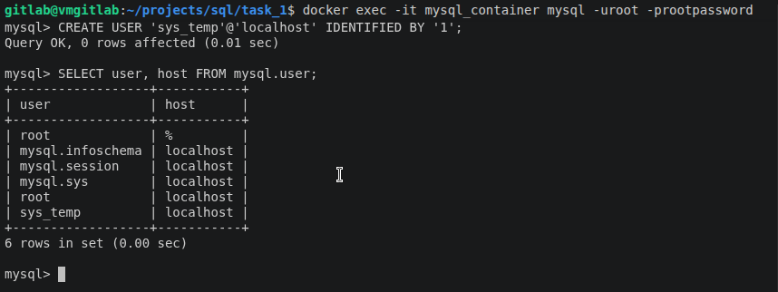
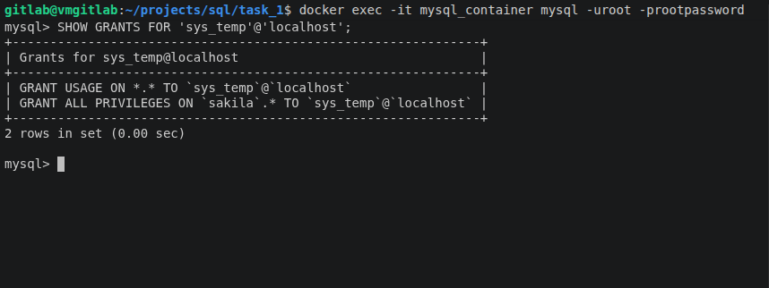
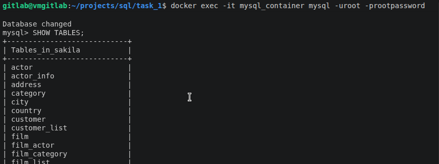
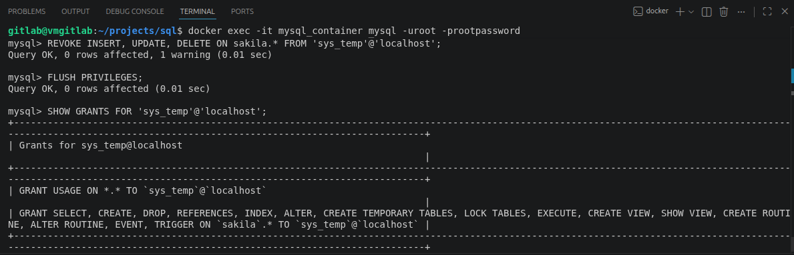

## Введение в SQL

### Задание 1

1.1. Поднимите чистый инстанс MySQL версии 8.0+. Можно использовать локальный сервер или контейнер Docker.
1.2. Создайте учётную запись sys_temp.
1.3. Выполните запрос на получение списка пользователей в базе данных. (скриншот)
1.4. Дайте все права для пользователя sys_temp.
1.5. Выполните запрос на получение списка прав для пользователя sys_temp. (скриншот)
1.6. Переподключитесь к базе данных от имени sys_temp.

Для смены типа аутентификации с sha2 используйте запрос:

ALTER USER 'sys_test'@'localhost' IDENTIFIED WITH mysql_native_password BY 'password';

1.6. По ссылке скачайте дамп базы данных.
1.7. Восстановите дамп в базу данных.
1.8. При работе в IDE сформируйте ER-диаграмму получившейся базы данных. При работе в командной строке используйте команду для получения всех таблиц базы данных. (скриншот)

### Решение







### Задание 2

Составьте таблицу, используя любой текстовый редактор или Excel, в которой должно быть два столбца: в первом должны быть названия таблиц восстановленной базы, во втором названия первичных ключей этих таблиц. Пример: (скриншот/текст)

### Решение 

[Таблица в текстовом редакторе](lesson_1/task_2.txt)
```
+---------------+----------------------+
| Table_name    | Primary_key          |
+---------------+----------------------+
| actor         | actor_id             |
| address       | address_id           |
| category      | category_id          |
| city          | city_id              |
| country       | country_id           |
| customer      | customer_id          |
| film          | film_id              |
| film_actor    | actor_id, film_id    |
| film_category | film_id, category_id |
| film_text     | film_id              |
| inventory     | inventory_id         |
| language      | language_id          |
| payment       | payment_id           |
| rental        | rental_id            |
| staff         | staff_id             |
| store         | store_id             |
+---------------+----------------------+
```
### Задание 3

1. Уберите у пользователя sys_temp права на внесение, изменение и удаление данных из базы sakila.
2. Выполните запрос на получение списка прав для пользователя sys_temp. (скриншот)

### Решение
