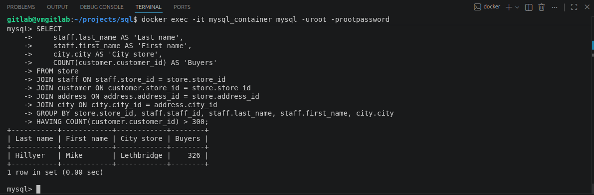
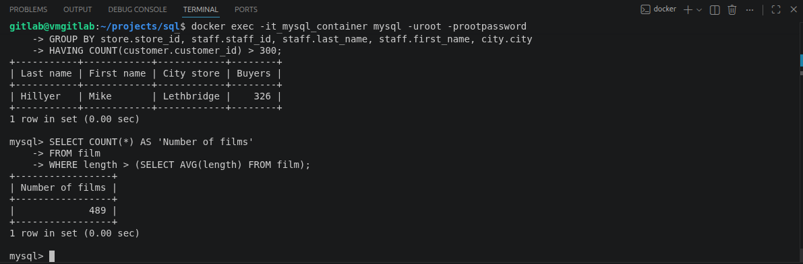
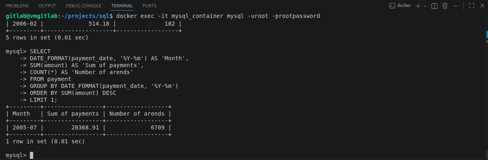
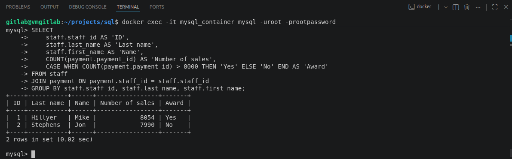

# Расширенные возможности SQL

## Задание 1

Одним запросом получите информацию о магазине, в котором обслуживается более 300 покупателей, и выведите в результат следующую информацию:

 * фамилия и имя сотрудника из этого магазина;
 * город нахождения магазина;
 * количество пользователей, закреплённых в этом магазине.

## Решение
```
SELECT
    staff.last_name AS 'Last name',
    staff.first_name AS 'First name',
    city.city AS 'City store',
    COUNT(customer.customer_id) AS 'Buyers'
FROM store 
JOIN staff ON staff.store_id = store.store_id
JOIN customer ON customer.store_id = store.store_id
JOIN address ON address.address_id = store.address_id
JOIN city ON city.city_id = address.city_id
GROUP BY store.store_id, staff.staff_id, staff.last_name, staff.first_name, city.city
HAVING COUNT(customer.customer_id) > 300;

+-----------+------------+------------+--------+
| Last name | First name | City store | Buyers |
+-----------+------------+------------+--------+
| Hillyer   | Mike       | Lethbridge |    326 |
+-----------+------------+------------+--------+
1 row in set (0.00 sec)
```


## Задание 2

Получите количество фильмов, продолжительность которых больше средней продолжительности всех фильмов.

## Решение
```
SELECT COUNT(*) AS 'Number of films'
FROM film
WHERE length > (SELECT AVG(length) FROM film);

+-----------------+
| Number of films |
+-----------------+
|             489 |
+-----------------+
1 row in set (0.00 sec)
```


## Задание 3

Получите информацию, за какой месяц была получена наибольшая сумма платежей, и добавьте информацию по количеству аренд за этот месяц.

## Решение
```
SELECT DATE_FORMAT(payment_date, '%Y-%m') FROM payment LIMIT 5;

+------------------------------------+
| DATE_FORMAT(payment_date, '%Y-%m') |
+------------------------------------+
| 2005-05                            |
| 2005-05                            |
| 2005-06                            |
| 2005-06                            |
| 2005-06                            |
+------------------------------------+
5 rows in set (0.01 sec)
```
```
SELECT
    DATE_FORMAT(payment_date, '%Y-%m') AS 'Month',
    SUM(amount) AS 'Number of payments',
    COUNT(*) AS 'Number of arends'
FROM payment
GROUP BY DATE_FORMAT(payment_date, '%Y-%m');

+---------+--------------------+------------------+
| Month   | Number of payments | Number of arends |
+---------+--------------------+------------------+
| 2005-05 |            4823.44 |             1156 |
| 2005-06 |            9629.89 |             2311 |
| 2005-07 |           28368.91 |             6709 |
| 2005-08 |           24070.14 |             5686 |
| 2006-02 |             514.18 |              182 |
+---------+--------------------+------------------+
5 rows in set (0.01 sec)
```
```
SELECT
    DATE_FORMAT(payment_date, '%Y-%m') AS 'Month',
    SUM(amount) AS 'Sum of payments',
    COUNT(*) AS 'Number of arends'
FROM payment
GROUP BY DATE_FORMAT(payment_date, '%Y-%m')
ORDER BY SUM(amount) DESC
LIMIT 1;

+---------+-----------------+------------------+
| Month   | Sum of payments | Number of arends |
+---------+-----------------+------------------+
| 2005-07 |        28368.91 |             6709 |
+---------+-----------------+------------------+
1 row in set (0.01 sec)
```


## Задание 4

Посчитайте количество продаж, выполненных каждым продавцом. Добавьте вычисляемую колонку «Премия». Если количество продаж превышает 8000, то значение в колонке будет «Да», иначе должно быть значение «Нет».

## Решение
```
SELECT
    staff.staff_id AS 'ID',
    staff.last_name AS 'Last name',
    staff.first_name AS 'Name',
    COUNT(payment.payment_id) AS 'Number of sales',
    CASE WHEN COUNT(payment.payment_id) > 8000 THEN 'Yes' ELSE 'No' END AS 'Award'
FROM staff
JOIN payment ON payment.staff_id = staff.staff_id
GROUP BY staff.staff_id, staff.last_name, staff.first_name;

+----+-----------+------+-----------------+-------+
| ID | Last name | Name | Number of sales | Award |
+----+-----------+------+-----------------+-------+
|  1 | Hillyer   | Mike |            8054 | Yes   |
|  2 | Stephens  | Jon  |            7990 | No    |
+----+-----------+------+-----------------+-------+
2 rows in set (0.02 sec)
```

