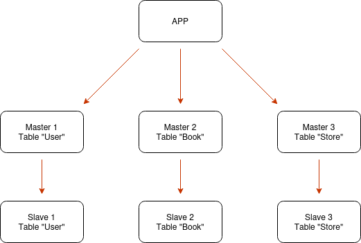
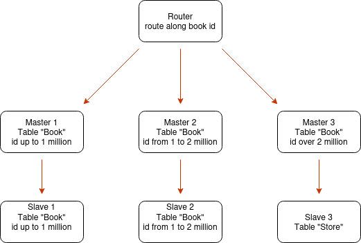

# Репликация и мастабирование часть 2

## Задание 1

Опишите основные преимущества использования масштабирования методами:

    активный master-сервер и пассивный репликационный slave-сервер;
    master-сервер и несколько slave-серверов;

Дайте ответ в свободной форме.

## Решение

### 1.  Активный Master server и пассивный Slave server

Эта схема прежде всего про отказоустойчивость. Ее суть заключается в том, что активный master осуществляет операции, такие как чтение и запись, а slave дублирует на себя данные из binary log, не участвуя в остальных оперциях. Slave пассивно дублирует базу с master.

Что дает:

* Отказоустойчивость - в случае выхода из строя master, можно перекинуть нагрузку на slaveю Пока идут работы по восстановлению master

* Снятие бэкапа без нагрузки на master - бэк можно снимать с пассивного slave, тем самым не нагружая master. Пользователь ничего не заметит

* Минимальная потеря данных - разница между master и slave секунды, поэтому при падении master теряются только самые последние записи

### 2. Master server и несколько обслуживающих Slave server

Эта схема уже про быстродействие при операциях чтения. В ней несколько slave осуществляют чтение, тогда как master осуществляет запись. Это имеет смысл, так как операции чтения более востребованы.

Что дает:

* Распределение нагрузки на чтение - выше уже написал, что операции на чтение более востребованы, увеличивая колличество slave, увеличивается производительность

* Географическое распределение - slave можно расположить в разных регионах, тем самым уменьшая время на отклик для пользователей из разных регионов

* Отказоустоичивасть - при падении одного slave, его нагрузку подхватят другие 

## Задание 2

Разработайте план для выполнения горизонтального и вертикального шаринга базы данных. База данных состоит из трёх таблиц:

* пользователи,
* книги,
* магазины (столбцы произвольно).

Опишите принципы построения системы и их разграничение или разбивку между базами данных.

Пришлите блоксхему, где и что будет располагаться. Опишите, в каких режимах будут работать сервера.

## Решение 

### 1. Вертикальный шаринг

При вертикальном шаринге я делю базу по таблицам: каждая таблица размещается на отдельном сервере. Таблица users уходит на первый сервер, books — на второй, stores — на третий. Приложение знает, за какой сущностью на какой сервер обращаться.
Такой подход изолирует нагрузку: тяжёлые запросы к книгам не влияют на работу с пользователями, а наращивать мощность можно точечно — только для того сервера, чья таблица нагружена сильнее. Основной минус — соединять данные из разных таблиц (например, книги и их магазины) одним SQL-запросом уже нельзя, так как они лежат на разных серверах; объединение приходится делать на стороне приложения.

### 2. Горизонтальный шардинг

При горизонтальном шардинге я делю строки одной таблицы. Беру самую большую и быстрорастущую таблицу — books — и разрезаю её на части (шарды) по ключу шардирования. В качестве ключа использую book_id и делю по диапазонам: книги с id от 1 до 1 млн лежат на первом шарде, от 1 до 2 млн — на втором, свыше 2 млн — на третьем.
Запросы направляет роутер: получив book_id, он по ключу определяет нужный шард и отправляет запрос только туда, не затрагивая остальные серверы. Так объём данных и нагрузка делятся между несколькими серверами.

### Режимы работы серверов

Каждый шард — это не одиночный сервер, а связка из master и slave. Master принимает операции записи для своего диапазона данных, slave хранит копию для чтения и служит горячим резервом на случай отказа master (failover). Вертикальные серверы (users, stores) при росте нагрузки тоже дополняются репликами по этой же схеме.

### Принципы построения

Ключевое решение — выбор ключа шардирования: он должен распределять данные равномерно, иначе один шард окажется переполнен, а другие будут простаивать (перекос). Также стоит учитывать, что запросы, охватывающие все шарды (например, поиск по всем книгам дороже определённой цены), выполняются медленнее, поскольку опрашивают каждый сервер и собирают результат воедино. Поэтому ключ шардирования выбирают по тому полю, по которому происходит большинство обращений. На практике оба подхода часто сочетают: сначала разносят таблицы по серверам вертикально, а самую тяжёлую таблицу дополнительно шардируют горизонтально.